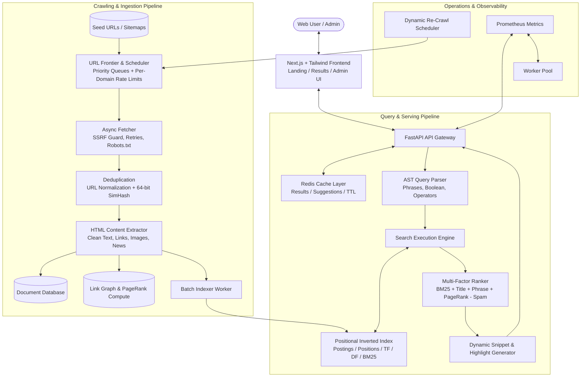

<div align="center">

# 🌐 NomEngine

**A Production-Grade Web Search Engine Built From Scratch**

[](https://python.org)
[](https://fastapi.tiangolo.com)
[](https://nextjs.org)
[](https://www.typescriptlang.org)
[](https://tailwindcss.com)
[](https://www.docker.com)
[](https://pytest.org)
[](LICENSE)

<p align="center">
  NomEngine is a distributed-ready, full-featured web search engine engineered independently from the ground up.<br/>
  <b>No Google, Bing, Brave, or SerpAPI wrappers. 100% custom crawler, indexer, and ranker.</b>
</p>

</div>

---

## 📑 Table of Contents

- [Architecture Overview](#-architecture-overview)
- [How to Crawl a Site from a URL](#-how-to-crawl-a-site-from-a-url)
- [Subsystems & Core Features](#-subsystems--core-features)
- [Quick Start with Docker Compose](#-quick-start-with-docker-compose)
- [Local Development Setup](#-local-development-setup)
- [Running Automated Tests](#-running-automated-tests)
- [CLI Reference](#-cli-reference)
- [Query Syntax Guide](#-query-syntax-guide)
- [Information Retrieval Evaluation](#-information-retrieval-evaluation)

---

## 🕸️ How to Crawl a Site from a URL

You can crawl any website using three convenient methods:

### Method 1: Using the Command-Line Interface (CLI)

Crawl any website by passing its URL:

```bash
# Crawl a specific site URL with 5 concurrent workers and a cap of 200 documents
python -m app.cli crawl https://example.com --concurrency 5 --max-docs 200

# Crawl multiple seed URLs from a text file
python -m app.cli crawl --seed seeds.txt --concurrency 10
```

After crawling finishes, compile the inverted index:
```bash
python -m app.cli index
```

---

### Method 2: Using the Web Admin Dashboard UI

1. Open **[http://localhost:3000/admin](http://localhost:3000/admin)** in your browser.
2. In the **Web Crawler Seed Manager** panel:
   - Paste the target website URL (e.g. `https://docs.python.org/3/` or `https://news.ycombinator.com/`).
   - Adjust the **Worker Concurrency** slider (1–20 workers).
3. Click **"Start Crawling"**.
4. The crawler will asynchronously fetch the domain, respect `robots.txt`, parse links, extract main content, and index documents in real time.

---

### Method 3: Using the REST API

Send a `POST` request to the `/api/admin/crawl` endpoint:

```bash
curl -X POST "http://localhost:8000/api/admin/crawl" \
  -H "Content-Type: application/json" \
  -d '{
    "urls": ["https://developer.mozilla.org/en-US/"],
    "priority": 100,
    "concurrency": 5
  }'
```

---

## 🏗️ Architecture Overview



---

## ⚡ Subsystems & Core Features

1. **URL Frontier & Scheduler:** Dual-level priority queues (1–100) and per-domain politeness throttling.
2. **Polite Async Fetcher:** Connection pooling with `httpx`, conditional requests (`ETag`, `If-Modified-Since`), exponential backoff, decompression (gzip, deflate, br), and body size caps (5MB).
3. **SSRF Guard:** Comprehensive network filter blocking internal subnets (`127.0.0.0/8`, `10.0.0.0/8`, `192.168.0.0/16`, `169.254.169.254`, `::1`).
4. **Multi-Tier Deduplication:** Canonical URL normalization, exact SHA-256 hash, and 64-bit SimHash for near-duplicate body detection.
5. **Positional Inverted Index:** Positional postings (`term -> {doc_id: [positions]}`) for sub-millisecond phrase adjacency queries.
6. **Multi-Factor Ranking Formula:**
   $$\text{Score} = w_{\text{bm25}} \cdot \text{BM25} + w_{\text{title}} \cdot S_{\text{title}} + w_{\text{phrase}} \cdot S_{\text{phrase}} + w_{\text{pagerank}} \cdot \text{PageRank} + w_{\text{freshness}} \cdot S_{\text{freshness}} + w_{\text{quality}} \cdot S_{\text{quality}} - p_{\text{spam}} \cdot \text{Penalty}_{\text{spam}}$$
7. **AST Query Parser:** Exact phrases (`"python tutorial"`), exclusions (`-django`), field filters (`site:`, `intitle:`, `inurl:`, `before:`, `after:`), and booleans (`OR`).
8. **Dynamic Snippet Generation:** Sliding term-density window with automatic `<b>...</b>` keyword highlighting.
9. **Next.js 14 Frontend:** Instant autocomplete, search tabs (All, Images, News, Videos), dark/light mode, keyboard shortcuts (`/` to focus).
10. **Admin Dashboard:** Telemetry metrics, live crawler pause/resume, ranking weight tuner sliders, and re-index triggers.

---

## 🚀 Quick Start with Docker Compose

Start the full stack (PostgreSQL, Redis, FastAPI API, Crawler Worker, Indexer Worker, Scheduler, and Next.js Frontend):

```bash
docker compose up --build -d
```

### Endpoints:
- **Search UI:** [http://localhost:3000](http://localhost:3000)
- **Admin Dashboard:** [http://localhost:3000/admin](http://localhost:3000/admin)
- **API Swagger Documentation:** [http://localhost:8000/api/docs](http://localhost:8000/api/docs)
- **Prometheus Metrics:** [http://localhost:8000/metrics](http://localhost:8000/metrics)

---

## 💻 Local Development Setup

### 1. Backend Setup
```bash
cd backend
python -m venv venv
# On Windows:
venv\Scripts\activate
# On Linux/macOS:
source venv/bin/activate

pip install -r requirements.txt
```

Start the API:
```bash
python -m app.main
```

### 2. Frontend Setup
```bash
cd ../frontend
npm install
npm run dev
```
Open [http://localhost:3000](http://localhost:3000).

---

## 🧪 Running Automated Tests

NomEngine includes a comprehensive test suite in `backend/tests/`:

```bash
python -m pytest backend/tests -v
```

### Test Coverage:
- `test_deduplication.py`: URL normalization, SHA-256 hashing, SimHash bitwise distance.
- `test_query_parser.py`: Exact phrases, negations, `site:`, `before:`, and technical terms (`C++`, `Next.js`).
- `test_inverted_index.py`: Positional postings, phrase verification, and term frequency.
- `test_ranking.py`: Okapi BM25 scoring, link graph PageRank power-iteration.
- `test_api.py`: FastAPI endpoints (`/api/search`, `/api/suggest`, `/api/health`).

---

## ⌨️ CLI Reference

```bash
# Crawl a site URL
python -m app.cli crawl https://docs.python.org/3/ --concurrency 5 --max-docs 500

# Batch index unindexed documents
python -m app.cli index

# Rebuild inverted index & recompute PageRank
python -m app.cli reindex

# View index statistics
python -m app.cli stats

# Run Information Retrieval benchmark evaluation
python -m app.cli evaluate --top-k 5
```

---

## 🔍 Query Syntax Guide

| Syntax | Description | Example |
| :--- | :--- | :--- |
| `term1 term2` | Standard relevance search | `python web framework` |
| `"exact phrase"` | Adjacent words in exact order | `"machine learning"` |
| `-word` | Exclude documents containing word | `python -django` |
| `site:domain.com` | Restrict search to specific domain | `site:python.org release` |
| `intitle:word` | Match word in document `<title>` | `intitle:fastapi tutorial` |
| `inurl:word` | Match word in document URL | `inurl:api documentation` |
| `before:YYYY-MM-DD` | Published before date | `before:2026-01-01 python` |
| `after:YYYY-MM-DD` | Published after date | `after:2025-01-01 python` |
| `term1 OR term2` | Union boolean query | `python OR rust` |

---

## 📊 Information Retrieval Evaluation

NomEngine includes an automated IR evaluation framework computing:
- **Precision@K:** Fraction of top-K results that are relevant.
- **Mean Reciprocal Rank (MRR):** Multiplicative inverse of the rank of the first relevant document.
- **NDCG@K:** Normalized Discounted Cumulative Gain against relevance judgments.

Run evaluation via:
```bash
python -m app.cli evaluate --top-k 5
```

---

## 📄 License

MIT License. Built for production-grade web search and information retrieval.
